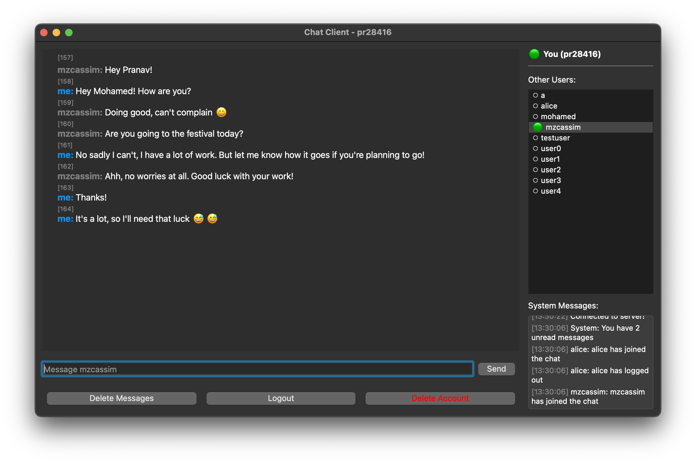

# Wire Protocol Chat Application

**Pranav Ramesh, Mohamed Zidan Cassim**

A multi-threaded chat application implementing custom wire protocols for efficient message transmission. The application features a PyQt5-based GUI client and supports both JSON and custom binary wire protocols for message serialization.

Check out `notebook.md` to see the engineering notebook that details our progress.



## Overview

This chat application demonstrates the implementation and comparison of different wire protocols for network communication. It includes a robust server that handles multiple concurrent client connections, a SQLite database for persistent storage, and a modern GUI client with features like direct messaging, message history, and user presence indicators.

## Features

- **User Management**
  - User registration and authentication
  - Account deletion
  - User presence indicators (online/offline status)

- **Messaging**
  - Real-time chat messaging
  - Direct messaging support
  - Message history with pagination
  - Read receipts and delivery status
  - Message deletion
  - Unread message tracking

- **Wire Protocols**
  - JSON protocol for human-readable messages
  - Custom binary protocol for efficient transmission
  - Protocol metrics logging and analysis
  - Automatic protocol negotiation

- **User Interface**
  - Modern PyQt5-based GUI
  - Dark/Light theme support
  - User list with online status
  - Chat history view
  - System message notifications

## Setup and Running

### Prerequisites

```bash
# Create and activate virtual environment
python -m venv .venv
source .venv/bin/activate  # On Windows: .venv\Scripts\activate

# Install dependencies
pip install -r requirements.txt
```

### Running the Server

```bash
# Start with JSON protocol (default)
python server.py

# Start with custom host and port
python server.py --host 0.0.0.0 --port 8000

# Start with custom binary protocol
python server.py --protocol custom

# Additional options
python server.py --help  # View all options
```

#### Server Command-Line Arguments

| Argument | Default | Description |
|----------|---------|-------------|
| `--host` | localhost | Host address to bind the server to |
| `--port` | 8000 | Port number to listen on |
| `--protocol` | json | Protocol type to use (choices: json, custom) |
| `--db-path` | chat.db | Path to the SQLite database file |

### Running the GUI Client

Once you have the server open, you can run multiple clients with the following commands:

```bash
# Start with JSON protocol (default)
python gui_client.py

# Start with custom host and port
python gui_client.py --host 0.0.0.0 --port 8000

# Start with custom binary protocol
python gui_client.py --protocol custom

# Enable protocol metrics logging
python gui_client.py --enable-logging

# Additional options
python gui_client.py --help  # View all options
```

#### Client Command-Line Arguments

| Argument | Default | Description |
|----------|---------|-------------|
| `--host` | localhost | Server host address to connect to |
| `--port` | 8000 | Server port number to connect to |
| `--protocol` | json | Protocol type to use (choices: json, custom) |
| `--enable-logging` | False | Enable protocol metrics logging |

## Usage Guide

### User Management

1. **Registration**
   - Launch the GUI client
   - Click "Register" in the login dialog
   - Enter desired username and password
   - System will automatically log you in after registration

2. **Login**
   - Launch the GUI client
   - Enter username and password
   - Click "Login"

3. **Account Deletion**
   - Click "Delete Account" button in the main window
   - Confirm deletion in the popup dialog

### Messaging

1. **Sending Messages**
   - Select a user from the right panel
   - Type message in the input field
   - Press Enter or click "Send"

2. **Direct Messages**
   - Same as regular messages, but they're private between you and the selected user

3. **Message History**
   - Select a user to view chat history
   - Scroll up to view older messages
   - Unread messages are indicated with a count

4. **Deleting Messages**
   - Click "Delete Messages"
   - Enter message IDs (space-separated)
   - Confirm deletion

### Protocol Selection

- Both server and client must use the same protocol
- JSON protocol is recommended for development/debugging
- Custom binary protocol is recommended for production use

## File Structure

### Core Components

- `server.py` - Multi-threaded chat server implementation
- `gui_client.py` - PyQt5-based graphical user interface
- `database.py` - SQLite database management
- `schemas.py` - Data models and message types
- `protocol.py` - Wire protocol implementations

### Supporting Files

- `requirements.txt` - Python package dependencies
- `protocol_analysis.md` - Wire protocol performance analysis
- `analyze_protocols.py` - Protocol metrics analysis tools

### Data Storage

- `chat.db` - SQLite database file (created on first run)
- `logs/` - Protocol metrics logs (when enabled)
  - `protocol_metrics.log` - Message size and performance data

### Tests

To run the tests, execute the following command:

```bash
pytest
```

- `test_server.py` - Server functionality tests
- `test_client_interactions.py` - Client interaction tests
- `test_protocols.py` - Protocol implementation tests
- `test_db.py` - Database operation tests

## Protocol Performance

The application supports two wire protocols:

1. **JSONProtocol**
   - Human-readable format
   - Larger message sizes
   - Easier debugging
   - Average message size: 238.0 bytes

2. **CustomWireProtocol**
   - Binary format
   - Compact message sizes
   - Better performance
   - Average message size: 53.8 bytes

For detailed performance metrics, see `protocol_analysis.md`.
